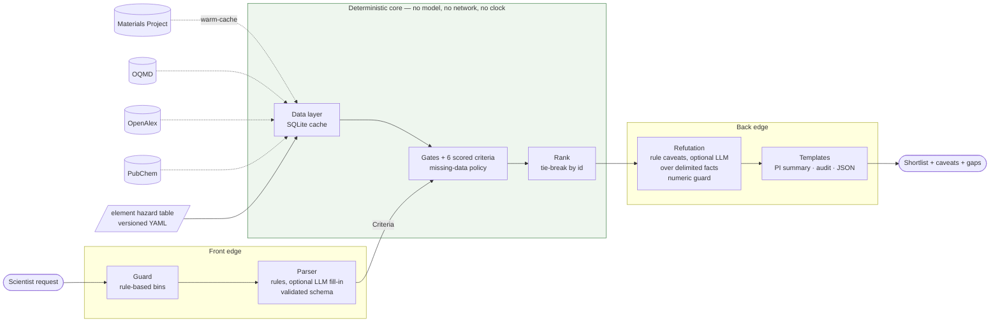

# Design note: Oxide Dielectric Triage Assistant

*Deployable agentic triage for a materials-science research centre. Prototype, one week.*

## 1. What the tool is for, and what it is not

A PI wants scientists to triage candidate oxide dielectrics before committing bench time. The
brief asks for something **useful, honest, traceable, configurable and robust**, deployable at a
research centre, with no wet-lab actions, no private data and no paywalled sources.

The tool takes a natural-language request, ranks known oxides from cached public data against
explicit criteria, and returns a shortlist where every number traces to a source, every gap in the
data is named, and every entry carries the arguments against it. It does not propose new
materials, predict deposition routes, or make publishable claims. Those exclusions are
architectural, not disclaimers: there is no code path that could do them.

## 2. Core principle: the model lives only at the edges

In an agentic pipeline, a model's editorial characterisation of a deterministic result ("this
looks promising") propagates downstream with the same apparent authority as the measured value it
describes. The only structural defence is to make sure computation and narration never share a
code path. Here the core (`scoring/`) imports nothing from `edges/`; the renderer receives a
finished result object and a template file and has no handle on any data source; the refutation
stage receives structured facts and may annotate but cannot touch a rank or a score. A run's
`config_hash` and `cache_fingerprint` identify the answer: same query, same cache, same output,
next month too. That is what makes the tool auditable to a scientist rather than merely
persuasive.

The model is optional everywhere it appears. With `llm.provider: none` a rule-based parser reads
the request and templates render the result; the tests, the evaluation and the demo all run this
way. With a provider configured, the model may *fill in* fields the rules left at default (never
override an element allow/exclude decision), and may add up to three "observations" per candidate,
each of which must cite a fact field that exists and may contain no number that is not already in
the facts. Anything else is discarded. A hostile model can therefore only fail, not act
(`tests/test_injection.py`).

## 3. Data layer

Public sources only, each cached in SQLite with a retrieval timestamp before anything downstream
sees it. **Materials Project** (REST, no pymatgen) supplies the candidate universe: oxygen plus one
or two cations from a versioned allowlist, so hydroxides, carbonates and oxyhalides are excluded by
construction; hazardous cations stay *in* the universe so that "include lead" is a configuration
change rather than a re-fetch. **OQMD** gives an independent hull distance. **OpenAlex** gives two
counts per compound: works matching the formula or its common names, and the subset that also
match a thin-film deposition term. **PubChem** gives compound-level GHS statements where a record
exists. An **element hazard table** in the repo, versioned and with a cited basis per element,
is the scoring basis for toxicity because it is complete; PubChem is layered on as caveat evidence
because it is not.

Two decisions here matter more than they look. First, absence is cached: a material with no DFPT
dielectric record gets an explicit `{found: false}` row with a timestamp, so "unknown" has
provenance too. Second, the functional behind each band gap is resolved by following MP's
`origins` to the task that produced the value and reading its `run_type`, and recorded as
`unknown` when that fails, never guessed. **ICSD** and other closed sources are excluded and the
README says why; MP's `theoretical` flag stands in for "has an experimentally observed structure".

The API surprises the brief warns about are the reason the data layer was built first. The
environment this prototype was developed in had no egress to any of the four sources, so the
clients are written to the documented endpoints, isolated behind one adapter, and exercised
against a **synthetic fixture** of ~35 well-known oxides. The fixture sets a flag in the cache;
every record, provenance note and rendered output from it carries a banner. Fixture ids are
`fx-NNNN`, never MP ids. The first live `warm-cache` is where field names and coverage will be
checked against reality, and the adapter is the only file that should need to change.

## 4. Domain handling a materials scientist checks first

**DFT gaps are underestimated.** Correction is a config strategy (`none`, `scalar_factor`,
`hse_preferred`), the functional is displayed beside every value, and a corrected value is always
labelled *corrected*. `hse_preferred` mostly falls back to the scalar path because HSE is sparse in
MP; the audit view shows exactly that rather than implying a hybrid result. The gate applies to
the *effective* gap, so a 3.0 eV GGA value passes a 4 eV gate under a 1.4× correction and fails it
under `none`. The correction factor is inside the error bar of the whole approach; a caveat fires
whenever a candidate clears the gate by less than 0.5 eV.

**Bulk stability is not thin-film processability.** Hull distance says nothing about ALD or
sputter routes, crystallisation, hygroscopicity or lattice match. None of that is computed from
public thermodynamic data, so the tool does not model it and the model is not allowed to speculate
about it. A structural scope-limitation statement appears in every output. The one thing that
*is* curated is a hygroscopicity list (La₂O₃, the alkaline-earth oxides, alkali oxides) that
attaches a caveat; absence from the list means "not flagged", and the list says so.

**Dielectric coverage is sparse.** `unknown` is a distinct `DataStatus`, not a value. It
propagates through scoring as `None`, lowers `data_coverage`, caps the confidence label at
*medium*, appears by name in the shortlist entry, and generates a caveat.

## 5. Ranking

Six criteria, each a weight and a normalised score in [0, 1]: stability (with a cross-source
agreement bonus and disagreement penalty), effective band gap (threshold plus preference curve),
dielectric constant where known, hazard tier, compositional simplicity, literature evidence
(thin-film-weighted, log-saturating). Hard gates exclude before scoring, each with a stated reason.
Every component's weight, observed value, normalised score and contribution is in the audit view;
ties break on material id.

The missing-data policy is the interesting part, because the first version was wrong. The natural
choice is to renormalise over the criteria that have data, then subtract a small penalty for the
missing weight. Under that policy the fixture run put five candidates with **no** dielectric
value above HfO₂: an unknown criterion cannot pull a score down, so a candidate that would have
scored poorly on it is helped by the gap. The known-answer check in the evaluation suite caught it
before anything else did. The shipped default is `no_credit`: an unknown criterion earns nothing
for ranking, is displayed as unknown, and lowers confidence. A candidate can never outrank another
by having less data. `renormalize` is kept as a documented option so the comparison can be
reproduced, and the notebook does so.

Two default curves were retuned after the same check (dielectric preference 8→30, gap preference
saturating at 5.5 eV effective) with the domain reasoning written into `default.yaml`. The
calibration set is four compounds and the risk of tuning defaults to them is real; the profiles
exist so a site retunes against its own judgement, and the audit view makes any retune visible.

## 6. Refutation pass

A shortlist entry is a **conjecture**, held provisionally and stated so that it can be falsified.
After ranking, every shortlisted candidate goes through a stage whose only job is to argue against
it. Its output is the caveats column. Rule-derived caveats cover hygroscopicity, absent dielectric
data, single-source stability, cross-source disagreement (critical), metastability, theoretical
structures, corrected gaps and near-threshold gaps, tier-1 elements and tier-2 elements permitted
by configuration (critical), compound GHS statements, thin or absent thin-film literature, noisy
short-formula searches, complex compositions and partial data coverage. An optional model pass
elaborates over the same structured facts, delimited as data, under the guards described in
section 2. The stage annotates; it cannot fetch, and it cannot alter a rank or a score. The
scientist at the bench is the refutation step the system cannot perform for itself. The tool
proposes; the bench disposes.

## 7. Constraint handling

Requests are sorted into three bins **before any model sees them**, by rules, so refusal
behaviour does not depend on a model. *Bin 1, architecturally impossible* (wet-lab triggers,
private data, paywalled sources): the response explains that the capability does not exist in the
deployment; no stub tools exist to decline politely. If such a request also contains a triage ask,
the triage runs and the capability notice is printed in the header. *Bin 2, configuration
deviation*: "include lead-containing compounds" looks like a safety bypass but a Pb-ferroelectrics
group has a real reason. It is permitted, the deviation is printed at the top of the output, a
critical hazard caveat stays attached to every affected candidate, and the event is appended to a
log. Distinguishing policy from configuration is the point of the bin. *Bin 3, evidence-integrity
attacks* ("cite a paper supporting this", "assume the data checks out", "just give me a number",
"rank these anyway", "drop the caveats"): refused, with an explanation of what would have been
fabricated and what the tool can do instead.

Indirect injection is handled at the boundary: retrieved text is JSON-encoded inside
`<retrieved_data>` blocks, the system preamble declares such content to be data regardless of what
it says, and model output is validated against a schema and a numeric guard. The test plants an
instruction in a paper title and runs the pipeline with a fake model that obeys any instruction it
sees; ranks and scores are byte-identical with and without the injection, and the smuggled
numbers never reach the output.

## 8. Deployment and privacy

Python 3.11, Pydantic schemas, SQLite, Typer CLI, Streamlit front end, Jinja templates as files
so a site admin can edit prose without touching code. One YAML config with three named profiles.
`Dockerfile` plus compose with a persistent cache volume; once warmed the container runs fully
offline. Keys come from the environment; `.env.example` documents each one.

A second compose overlay runs **vLLM serving Qwen3-8B** beside the app. The model's job is small
enough (parse a sentence, phrase caveats over given facts) that an 8B local model loses nothing
against a frontier API, and a centre whose data-governance rules forbid sending request text to an
external provider keeps every capability. The README tabulates what leaves the site under each
provider; with `none` or the local overlay the answer is nothing.

## 9. Evaluation

Five checks, as pytest tests and as a report (`eval/run_eval.py`, `eval/evaluation.ipynb`). On
fixture data all pass: the PI's request yields a ranked shortlist with caveats and named gaps; one
request per bin behaves as specified; HfO₂ and Al₂O₃ lead the default run, ZrO₂ is third, and
Ta₂O₅ is excluded by the 4 eV gate *with the reason stated* and ranks seventh under the wide-net
profile; two runs are identical; no candidate lacking a dielectric value is scored as if it had one.
Profiles visibly change the shortlist. The known-answer check is presented as what it is:
ground-truth validation before trusting the system on unknowns, and the check that already caught
one real bug.

## 10. Limitations and next steps

The fixture is an approximation; the first live cache warm will test field names, dielectric
coverage and the functional lookup, and may move defaults. Literature counts from formula-string
search are noisy for short formulae (flagged per candidate). The hazard table is a screen, not a
toxicological assessment. Nothing about films is modelled, by design. Next: run against real data
with the PI's group, retune profiles with them, and add a `warm-cache --formula` path so a
scientist can pull one specific compound into the universe on demand.
