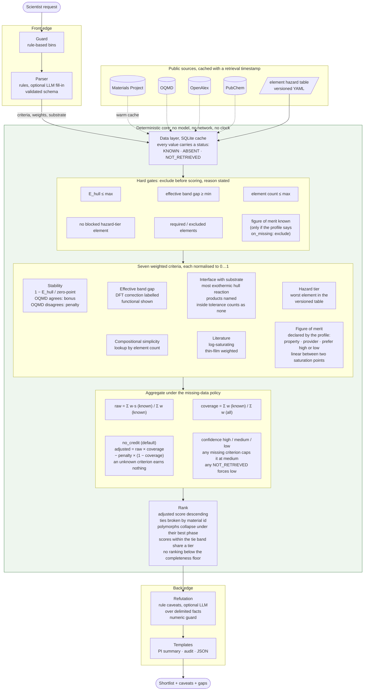

# Design note: Oxbow, a materials-triage system, instantiated for oxide dielectrics

*Deployable agentic triage for materials-science research*

## 1. Project Philosophy

I went into this project with a few goals in mind: I wanted to create something useful, something scientifically robust, and (most importantly) something that I would want to use myself. 

When I was in the field with USGS or Lincoln Labs, nothing would sour a trip quite like software that made the job harder. If I am 5 miles off the Atlantic coast on an 18ft Boston Whaler, during a light rain, in March, I do not want a CLI. If I'm in a remote site a couple hours outside of Vegas with spotty satellite internet, I don't want my workflow to stop when the network goes down.

When it comes to AI-enabled systems, the criteria is even simpler: I don't want something that will lie to me. 

All that (and combined with the provided brief) left me with these objectives: A useable, deterministic material science triage system that is as ready for the hyper-connected public university lab as it is the airgapped research site buried under a mountain. 

Oxbow is my answer to this. It takes a natural-language request, ranks known materials from cached public data against explicit criteria, and returns a ranked shortlist. In this list, every number is auditable and traceable to its origin. Every data gap is named, and every entry carries the arguments against it. The system is designed from the ground up with LLM integration in mind, but can fall back to a pure rules based approach if needed.

This system does not propose new materials or make publishable claims. The oxide-dielectric instance is built out in full because only a worked instance can show that the citations are real and the caveats are the ones a scientist would raise. A second instance, thermal barrier coatings, shows that that one instance is not the entire system.

## 2. General Architecture

A note on LLMs and Scientific Integrity:
A model's characterisation of a otherwise deterministic result (e.g. "this looks promising" or "this is a novel approach") propagates downstream with the same authority of the value it describes. I call this "semantic smuggling". To combat this, computation and narration never share a code path. (`scoring/`) (the core) imports nothing from `edges/` (the LLM); the renderer receives a finished result and a template. The refutation stage may annotate structured facts but cannot touch a rank or a score. 

Large language model integration is intended for full functionality, but is optional. With a model configured it may fill parser fields the rules left at default and add up to three observations per candidate, each citing an existing fact field and containing no number absent from the facts. Follow up conversations and drilling down into results is where having the language model enabled really shines.

## 3. Data layer

Public sources only, each cached in SQLite with a retrieval timestamp. 
**Materials Project** supplies the candidate universe (oxygen plus one or two cations from a versioned allowlist, observed structures only), hull and band-gap data with the functional read from the producing task, the hull phases behind the interface criterion, and the property behind the figure of merit. 
**OQMD** gives an independent hull distance, 
**OpenAlex** a compound's works and their thin-film subset, 
**PubChem** GHS statements where a record exists. 
A versioned **element hazard table** in the repo scores toxicity because it is complete; PubChem is caveat evidence because it is not.

## 4. Domain handling

**DFT gaps are underestimated.** Correction is a config strategy, the functional is shown beside every value, a corrected value is labelled, and the gate applies to the effective gap. 

**Bulk stability is not thin-film processability.** Hull distance says nothing about deposition routes or lattice match; the tool does not model them, the model may not speculate about them, and every output says so.

**There are two kinds of unknown, and merging them corrupts the ranking.** Materials Project holds no dielectric tensor for most candidates: a fact about the data. A cross-check that was rate-limited away is a hole in *this* cache. Both lower a score, so when our first warm died partway through, the head of the ranking was the subset whose downloads had finished. So the status splits into *absent* and *not retrieved*: the arithmetic is unchanged, since crediting an unfetched candidate would be the worse error, but incomplete retrieval is a critical caveat, each result reports its completeness, and below a floor no ranking is served. Only one of the two is fixable by warming, and the output says which. A record the source holds but flags as unusable is *absent*, with the warning quoted, never a value.

## 5. Ranking

Seven criteria, each a weight and a normalised score in [0, 1]. Six are the same for any material class: thermodynamic stability (with a cross-source agreement bonus and disagreement penalty), effective band gap, stability of the interface with a configured substrate, hazard tier, compositional simplicity, and literature evidence (thin-film-weighted, log-saturating). The seventh is the application's **figure of merit**, declared by the profile: which property, from which provider, under what label, units and method, preferred high or low between two saturation points, and what happens when it is missing. For the oxide-dielectric profiles it is the DFPT dielectric constant.

The interface criterion is the one the others cannot do without. Among good oxides the rest saturate, and what separated HfO2 from the field was that it does not react with silicon. That is a hull question (Hubbard and Schlom, 1996): mix the candidate with the substrate, find the lowest-energy combination of stable phases at each composition by a small linear programme over Materials Project's thermo entries, and report the most exothermic reaction, products named; reactions inside a stated tolerance count as none, since hull energies carry that much error. Hard gates exclude before scoring with a stated reason; every contribution is in the audit view; ties break on material id; polymorphs collapse under their best phase.

The missing-data policy is somewhat battle tested, because the first version I made was just flat wrong. Renormalising over the criteria that have data put five candidates with **no** dielectric value above HfO2 on the fixture: an unknown criterion cannot pull a score down, so a candidate that would have scored poorly on it is helped by the gap. The groundtruth check caught it (this is why we love groundtruth, All Hail Groundtruth) The shipped default is `no_credit`: an unknown criterion earns nothing, is shown as unknown and lowers confidence, so less data can never mean a higher rank. Scores closer than a tie band print as one tier with the order inside it declared arbitrary.

## 6. Retargeting to a new material class

These files change to instantiate a class:

- `config/profiles/<class>.yaml`: the `figure_of_merit:` block, the substrate, the weights (a class may zero the band gap, an insulator-class criterion, not a universal one), the universe bounds, the words the parser and guard accept, the self-check's workhorses and request, and the class's refutation switches.
- `oxide_triage/data/cation_allowlist_<class>.yaml`: the cation universe, in families with a rationale each.
- `oxide_triage/sources/properties.py`: a provider, only if the property is not already served. A provider answers "property *P* for material *M*, with provenance and a retrieval timestamp"; the two shipped ones are Materials Project's dielectric and elasticity routes.
Nothing in `scoring/`, the refutation pass, the guard, the templates or the front end names a class. An FDE fills those files with the site's scientists: agree the figure of merit and its saturation points, name the workhorses the self-check must reproduce (it fails loudly if a known material vanishes or sinks, and names the honest reasons when it does), choose the substrate, prune the cation universe, switch on the refutation rules the class needs. Two limits stay fixed: the universe is oxides (the anion is a second seam, untouched here, which is why fluoride UV windows were not the second class), and the arithmetic and the model boundary are not per-class.

## 7. Refutation pass

A shortlist entry is treated as a **conjecture**, held provisionally and stated so that it can be falsified. After ranking, a stage whose only job is to argue against each shortlisted candidate adds its caveats: hygroscopicity, absent figure-of-merit data, contested stability, metastability, corrected or near-threshold gaps, hazard tiers, thin literature, incomplete retrieval, and, where a profile switches them on, a competing polymorph within a few meV/atom and a 4f-element gap DFT cannot be trusted with. An optional model pass elaborates over the same facts, delimited as data, under the guards of section 2. The tool proposes; the bench disposes.

## 8. Evaluation

Eight checks, as pytest tests and as a report, pass on the fixture and the live cache: the PI's request; adversarial requests in every bin, with legitimate phrasings running plain; every shipped profile's known answers (workhorses surface or are excluded by a stated gate); determinism; missing data never scored as a value; a sensitivity sweep of every weight and tuned parameter; the interface criterion against Hubbard and Schlom's held-out classification, 21 of 21 hard assertions; and held-out phrasings written after the rules. The known-answer check has caught two real bugs and reports `INCONCLUSIVE` rather than `FAIL` on a sparse cache. On live data the oxide-dielectric default ranks LaAlO3, HfO2, SrHfO3, LaScO3, ZrO2, with HfO2 2nd, ZrO2 5th, Al2O3 9th of 317 and Ta2O5 99th, explained by its reaction with Si.

The thermal-barrier profile runs the same engine on the same cache with no code change and a visibly different, defensible answer. Its figure of merit is Clarke's minimum thermal conductivity from Materials Project's elastic tensors, lower preferred; its substrate is the alumina scale on the bond coat. Of 750 candidates 394 pass; the rare-earth sesquioxides lead (Gd2O3, Er2O3, La2O3, Lu2O3 at 0.8-0.9 W/m·K against zirconia's 1.13), HfO2 is 12th and ZrO2 15th, and the caveats argue with the leaders: hygroscopicity, reaction with the alumina scale (Y2O3 forms the garnet), a competing polymorph. Alumina and magnesia, good conductors, score zero and sit near 100th. One workhorse cannot be verified from public data and the self-check says so by name: Materials Project holds no elastic tensor for La2Zr2O7, which ranks 131st on its other criteria; Gd2Zr2O7 has no experimentally observed entry and is outside the universe by construction.

The seam itself is proven twice: a golden snapshot of every number, status and caveat the four oxide-dielectric profiles produce on the fixture, and a before-and-after diff of the live-cache evaluation (identical ranks, sensitivity table and cache fingerprint; only labels and the config hash moved).

## 9. Limitations

Which polymorph a film adopts is not modelled beyond the collapsed listing and, for thermal barriers, a caveat. Literature counts from formula-string search are noisy for short formulae, and flagged. The hazard table is a screen, not a toxicological assessment. Nothing about films is modelled beyond the bulk thermodynamics of the interface. The thermal-barrier profile ranks on conductivity, stability and compatibility only: melting point, thermal expansion, sintering, CMAS attack and toughness have no public per-material source and are named as unmodelled on every output. 

The universe is oxides. Another anion would be the next step but out of scope for this project. 
